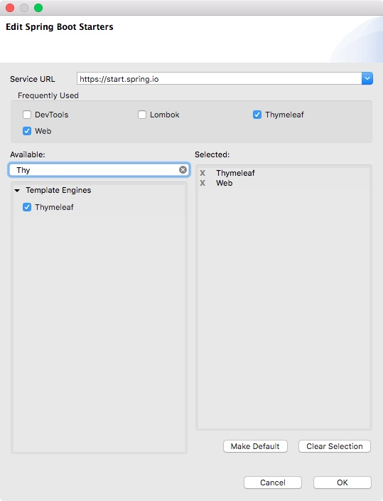

Das Erzeugen ganzer Webanwendungen auf diese Weise ist etwas mühsam (uach auch nicht die empfohlene Vorgehensweise), weshalb nun der zweite Bestandteil des MVC-Pastterns eingeführt wird, eine View-technologie. Während man früher mit JSP gearbeitet hat ist heute Thymeleaf eine beliebte Technologie. Wie bei JSPs finden sich XXX m Code, dieser ist allerdings weiterhin gültiges html. Das hat den Vorteil, dass WYSIWYG-Editoren die Seite anzeigen können und Designer den html-Code anpassen können. 

Um Thymeleaf nutzen zu können wird der zugehörige Starter zugefügt. Im Kontextmenü des Pom öffnet Spring > Edit Starters wieder den bekannten Assistenten. Hier wird nun Thymeleaf zugefügt. 




Im Pom findet sich danach der zugehörige Eintrag in den Dependencies:

```xml
<dependency>
	<groupId>org.springframework.boot</groupId>
	<artifactId>spring-boot-starter-thymeleaf</artifactId>
</dependency>
```

Da der Assistent nur diesen Eintrag zufügt könnte man das übrigens auch von Hand erledigen.

Das Zufügen des Starter in die Dependencies ruft wieder die Autoconficuration auf den Plan. Sie konfiguriert einen ViewResolver(was ist das?)  für Thymeleaf. Der wiederum geht davon aus, dass sich Thymeleaf Templates unter src/main/ressources/templates liegen. Hier legen wir nun home.html mit folgendem Inhalt an:

```html
<!DOCTYPE HTML>
<html xmlns:th="http://www.thymeleaf.org">
<head>
    <title>Home</title>
    <meta http-equiv="Content-Type" content="text/html; charset=UTF-8" />
</head>
<body>
    <p th:text="'Hello World from Template'" />
</body>
</html>
```

Neben der Namespace-Deklaration weist nur die Zeile mit der Ausgabe (th:text) auf Thymeleaf hin.

Damit das Template (vom ViewResolver ?) gefunden wird, sind kleine Änderungen am Controller nötig. Die neue Version hat einen Rückgabewert vom Typ String. Der Wert, der hier zurückgegeben wird, ist der Name des zu verwendenden Templates (hier also *home*). Die Endung *html* hängt der ViewResolver selber an. Da der Inhalt der Webseite nun vom Template kommt, kann auch auf das Schreiben in die ServletResponse verzichtet werden:

```java
@GetMapping("/")
public String ping() throws IOException {
	return "home";
}
```
