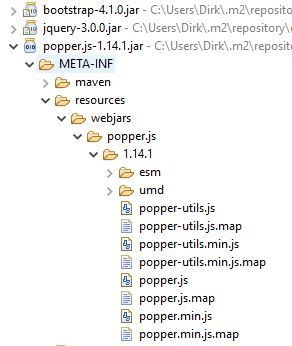

# WebJars

Die Tymeleaf-Seiten mit den einfachen HTML-Tags und ohne CSS sehen noch recht hässlich aus. Eine einfache Methode das zu ändern, ist das Einbinden von Bootstrap. Das ursprünglich von Twitter entwickelte CSS-Framework ist so etwas wie das Schweizer Taschenmesser für die Webentwicklung und unterstützt Responsive Design, ohne das man inzwischen nicht mehr auskommt.

Bootstrap lässt sich wie andere CSS-Bibliotheken über den Link-Tag mit einem Verweis auf die Bootstrap-Seiten im Netz einbinden. Schicker in Maven-Projekten ist allerdings das Einbinden als WebJar. Wie der Webseite des Projekts (https://www.webjars.org) zu entnehmen ist handelt es sich dabei um  Client-seitige Web Libraries, die in JAR-Dateien ausgeliefert werden und somit über Maven integriert werden können.

Auf der Webseite findet sich eine Auflistung der Projekte die als WebJar paketiert sind.

Für Bootstrap sieht die Maven-Dependency folgendermaßen aus:

```xml
<!-- https://mvnrepository.com/artifact/org.webjars/bootstrap -->
<dependency>
    <groupId>org.webjars</groupId>
    <artifactId>bootstrap</artifactId>
    <version>4.1.0</version>
</dependency>
```

Bootstrap benötigt jQuery und Popper.js, die Bibliotheken werden dank Maven automatisch eingebunden.

Nun muss lediglich noch der Import der Stylesheets und des Javascripts im HTML-Code erfolgen und einem Facelift der Seiten steht nichts mehr im Wege:

```html
<head>
  <link rel="stylesheet" href="/webjars/bootstrap/4.1.0/css/bootstrap.min.css">
  ...
</head>

<body>
  ...
  <script src="/webjars/jquery/3.0.0/jquery.min.js"></script>
  <script src="/webjars/popper.js/1.14.1/popper.min.js"></script>
  <script src="/webjars/bootstrap/4.1.0/js/bootstrap.min.js"></script>
</body>
```

Für die geschilderte Vorgehensweise benötigt man natürlich die Versionen und Pfade der eingebundenen Bibliotheken. Man findet diese zum Beispiel unter *Maven Dependencies* im Project Explorer:



Wer sich mit den Versionen nicht beschäftigen möchte kann das Projekt *webjars-locator* als Dependency im POM zufügen:

```xml
<!-- https://mvnrepository.com/artifact/org.webjars/webjars-locator -->
<dependency>
    <groupId>org.webjars</groupId>
    <artifactId>webjars-locator</artifactId>
    <version>0.38</version>
</dependency>
```

Nach dem Neustart lassen sich die Bibliotheken ohne Versionsnummern, also folgendermaßen einbinden:

```html
<head>
  <link rel="stylesheet" href="/webjars/bootstrap/css/bootstrap.min.css">
  ...
</head>

<body>
  ...
  <script src="/webjars/jquery/jquery.min.js"></script>
  <script src="/webjars/popper.js/popper.min.js"></script>
  <script src="/webjars/bootstrap/js/bootstrap.min.js"></script>
</body>
```
Damit liegt die Kontrolle über die Boostrap-Version nun komplett im POM, wo sie bei Maven-Projekten ja auch hingehört. Der Umstieg auf eine neuere Boostrap-Version ist lediglich in der Dependency-Version anzugeben.
