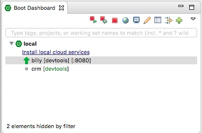

# Spring Tool Suite

In diesem Buch wird die **Spring Tool Suite**, kurz *STS* als Entwicklungsumgebung genutzt. Man kann STS kostenlos auf den Webseiten von Pivotal[^1] für die gängigen Betriebssysteme herunterladen. Die beliebteste Variante von STS, *Spring Tools for Eclipse*, basiert auf *Eclipse* und dürfte damit den meisten Java-Entwicklern bekannt vorkommen. Sie wird hier verwendet. Daneben gibt es STS noch als Erweiterung für Visual Studio und Atom. Die Spring Tool Suite unterstützt den Entwickler mit hilfreichen Views und Assistenten. Die wichtigsten Helfer werden im Folgenden vorgestellt.

## Boot Dashboard

Das Boot Dashboard, erreichbar über `Window > Show View > Other`, ist eine View mit der sich Spring Boot Prozesse einfach starten oder beenden lassen. Der Zustand (gestartet oder nicht) wird über einen grünen Pfeil visualisiert. Grade wenn man sehr viele Projekte im Workspace hat (was bei Microservice-Projekten ja durchaus mal vorkommt) ist die View eine großartige Hilfe, um den Überblick zu behalten. Hinter dem Namen des Projekts findet sich noch die Angabe, ob das Projekt die *devtools* aktiviert hat (dazu später mehr), sowie der Port, unter dem das Projekt erreichbar ist.

Mit Hilfe der Buttonleiste am oberen Rand lassen sich ausgewählte Projekte starten, debuggen oder beenden. Ein Klick auf das Weltkugel-Icon öffnet einen Browser mit der Default-URL des Services. 

Die View hat noch mehr Funktionen, die aber hier erst mal nicht interessieren.

## Spring Initializr

Der schnellste Weg, um zu einem Spring Boot-Projekt zu gelangen, ist es generieren zu lassen. Spring bietet im Netz [^2] dafür ein Werkzeug namens *Spring Initializr* (oder auch *Spring Starter*) an. Der Initializr hat eine REST-API, sodass er in andere Anwendungen integriert werden kann. In STS findet man das Werkzeug unter `File > New > Spring Starter` Project. Wer mit Spring Boot beginnt, sollte auf jeden Fall diesen Assistenten benutzen, um Spring-Projekte anzulegen.

## Diverse Helferlein

STS hat noch mehr Werkzeuge zur Unterstützung der Spring-Programmierung. Die sind allerdings nicht so auffällig wie das Dashboard oder der Spring Starter-Assistent. Kleine Helferlein wie Syntax-Highlighting, Code-Completion oder Unterstützung bei der Navigation im Code sind perfekt in die IDE integriert. Sie bemerkt man erst, wenn sie fehlen.

Im nächsten Abschnitt legen wir ein Projekt mit dem Initializr an.

[^1]:https://spring.io/tools
[^2]: https://start.spring.io

