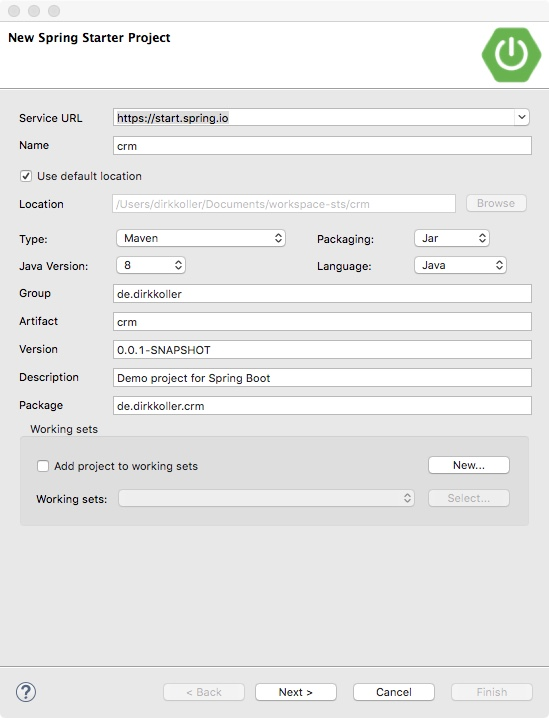
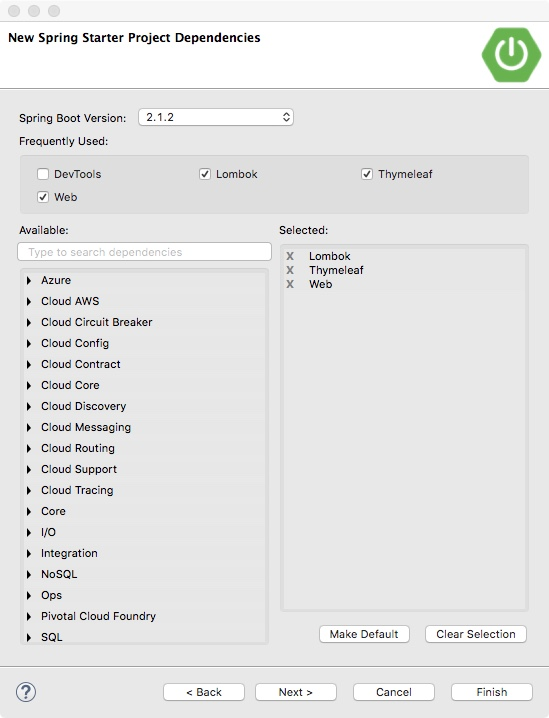

# Spring Starter

Spring Boot-Projekte lassen sich in der *Spring Tool Suite* bequem mit dem Spring Starter erstellen. Man findet den Assistenten unter `File > New > Spring Starter Project`.


## Der Spring Starter-Assitent

Der Assistent fragt einige Daten ab. Unter anderem den Namen des Projekts, den Speicherort, den Projekttyp (Maven oder Gradle) und die Maven-Koordinaten (Group, Artifact, Version usw). Um dem Buch optimal folgen zu können, empfiehlt es sich die Eingaben aus dem folgendem Screenshot zu machen:



Auf der nächsten Seite des Assistenten werden dem Projekt benötigte Dependencies zugefügt. Hier ist das vorerst nur *Web*, weitere Abhängigkeiten folgen später. 



Der Assistent wird mit *Finish* abgeschlossen und kurze Zeit später findet man das generierte Projekt im STS *Package- oder Project Explorer* . 

## Das erzeugte Projekt

Die Projektstruktur entspricht bei obigen Eingaben der eines Maven-Projekts und sollte Java-Entwicklern vertraut sein. Interessant ist vor allen Dingen die Klasse `CRMApplication`. Die Klasse enthält die main-Methode zum Start der Sprint Boot-Anwendung, die mit der Klassenmethode `SpringApplication.run` initiiert wird. Die Annotation `@SpringBootApplication` ist eine Sammel-Annotation, die `@Configuration`, `@EnableAutoConfiguration` und `@ComponentScan` bündelt. Was diese Annotationen bedeuten wird im weiteren Verlauf noch ausführlich besprochen, hier genügt es Notiz davon zu nehmen.

Ebenfalls lohnenswert ist ein Blick in die erzeugte POM-Datei. Spring-relevant ist hier der Parent *spring-boot-starter-parent* mit der aktuellen Spring Boot-Version, über den das POM zahlreiche Einstellungen erbt.

```xml
<parent>
	<groupId>org.springframework.boot</groupId>
	<artifactId>spring-boot-starter-parent</artifactId>
	<version>2.1.2.RELEASE</version>
	<relativePath/> <!-- lookup parent from repository -->
</parent>
```

In den Dependencies finden sich die spring-boot-starter-Abhängigkeiten *web*, die im Assistenten zugefügt wurde. Außerdem *spring-boot-starter-test*, da Spring Boot davon ausgeht, dass Tests auf jeden Fall benötigt werden. Die spring-boot-starter-Abhängigkeiten enthalten selber keinen Code. Vielmehr bündeln sie mehrere Bibliotheken in zueinander passenden Versionen zu einem Thema.

```xml
<dependencies>
	<dependency>
		<groupId>org.springframework.boot</groupId>
		<artifactId>spring-boot-starter-web</artifactId>
	</dependency>
	<dependency>
		<groupId>org.springframework.boot</groupId>
		<artifactId>spring-boot-starter-test</artifactId>
		<scope>test</scope>
	</dependency>
</dependencies>
```

Schließlich folgt noch das *spring-boot-maven-plugin*, mit dessen Hilfe ein ausführbares Jar aus dem Projekt erzeugt werden kann. 

```xml
<plugin>
	<groupId>org.springframework.boot</groupId>
	<artifactId>spring-boot-maven-plugin</artifactId>
</plugin>
```

Erfahrene Web-Entwickler horchen jetzt womöglich auf: ein Jar? Ja, ein Jar. Anders als klassische Java-Webanwendungen werden Spring Boot Web-Projekte meist nicht als War sondern als ausführbares Jar deployt. In der Standardkonfiguration wird die Anwendung dann von einem eingebetteten Tomcat-Server ausgeliefert. Dass es sich um ein Webprojekt handelt hat Spring Boot messerscharf aus der Einbindung des Web-Starter gefolgert. Diese bemerkenswerte Fähigkeit von Spring Boot, aus der Einbindung von bestimmten Bibliotheken auf den Anwendungszweck zu schließen, nennt sich *Autoconfiguration* und wird uns noch öfter begegnen.

Ansonsten besteht das Projekt nur noch aus ein paar leeren Ordnern, einem ebenfalls leeren Konfigurationsfile (application-properties), einer Testklasse und den beiden Maven-StartupScripten *mwnw* und *mvnw.cmd*. 

Die Anwendung tut zwar noch nichts (die Geschäftslogik fehlt ja noch), aber sie lässt sich schon starten. Dazu gibt es mehrere Möglichkeiten wie das Kontextmenü von CRMApplication.java öffnen, `Run As > Spring Boot App` oder das im vorherigen Abschnitt vorgestellte Boot Dashboard. 

Hat das geklappt, taucht der Spring-Schriftzug in ASCII-Art in der Konsole auf. Den Logmeldungen in der Konsole kann man entnehmen, dass Tomcat auf Port 8080 lauscht. Ein Aufruf von http://localhost:8080 führt momentan noch zu einer Fehlermeldung, aber immerhin wird diese schon als HTML gerendert. Im nächsten Kapitel beginnen wir mit der Implementierung einer Webanwendung.

```
  .   ____          _            __ _ _
 /\\ / ___'_ __ _ _(_)_ __  __ _ \ \ \ \
( ( )\___ | '_ | '_| | '_ \/ _` | \ \ \ \
 \\/  ___)| |_)| | | | | || (_| |  ) ) ) )
  '  |____| .__|_| |_|_| |_\__, | / / / /
 =========|_|==============|___/=/_/_/_/
 :: Spring Boot ::        (v2.1.2.RELEASE)
```


[^1]: https://start.spring.io
[^2]:https://spring.io/tools
[^3]: https://projectlombok.org


