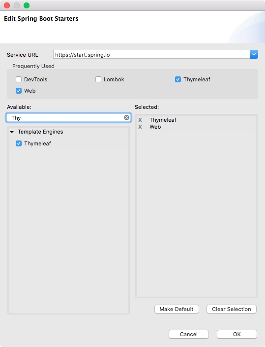

# Spring Views mit Thymeleaf

Im letzten Abschnitt wurde gezeigt, wie unserer Anwendung mit einen RestController eine erste Ausgabe entlockt werden kann. Auf ähnliche Weise könnte man durch Rückgabe von JSON-Daten auf der Clientseite gerenderte Webseiten bauen (zum Beispiel Single-Page-Webanwendungen mit AngularJS).  

Das ist auf jeden Fall ein spannendes Thema, das später noch eingehend behandelt wird. Hier soll jetzt aber zunächst eher der der klassische Weg serverseitig generierter Webseiten verfolgt werden. Während man früher mit Java Server Pages (JSP) gearbeitet hat, ist heute *Thymeleaf* meist die View-Technologie der Wahl. Wie bei JSPs finden sich spezielle Thymeleaf-Attribute im Code, dieser ist allerdings weiterhin gültiges html. Das hat den Vorteil, dass WYSIWYG-Editoren die Seite anzeigen und somit Designer den html-Code leicht anpassen können. 

Um Thymeleaf nutzen zu können wird, der zugehörige Starter zugefügt. Im Kontextmenü des Pom öffnet `Spring > Edit Starters` wieder den bekannten Assistenten. Hier wird nun Thymeleaf zugefügt: 



Im Pom findet sich danach der Thymeleaf-Eintrag in den Dependencies:

```xml
<dependency>
	<groupId>org.springframework.boot</groupId>
	<artifactId>spring-boot-starter-thymeleaf</artifactId>
</dependency>
```


Da der Assistent nur diesen Eintrag ergänzt kann man das übrigens auch von Hand erledigen.
Das Zufügen des Starter in die Dependencies ruft wieder die Autoconficuration auf den Plan. Sie konfiguriert einen ViewResolver für Thymeleaf. Der wiederum geht im Standardfall davon aus, dass sich Thymeleaf-Templates unter src/main/ressources/templates befinden. Hier legen wir nun home.html mit folgendem Inhalt an:

```html
<!DOCTYPE HTML>
<html xmlns:th="http://www.thymeleaf.org">
<head>
    <title>Home</title>
    <meta http-equiv="Content-Type" content="text/html; charset=UTF-8" />
</head>
<body>
    <p th:text="'Hello World from Template'" />
</body>
</html>
```

Neben der Namespace-Deklaration weist nur die Zeile mit der Ausgabe (th:text) auf Thymeleaf hin.

Damit das Template gefunden wird, sind kleine Änderungen am Controller nötig. Es wird kein RestController benötigt, sondern ein einfacher (Web-) Controller, der durch Anpassen der Annotation in der bestehenden Controller-Klasse erzeugt wird:

```java
@Controller
public class CRMController {
	
  @GetMapping("/")
  public String home() throws IOException {
    return "home";
  }
}
```

Ebenfalls geändert wurde der Rückgabewert, der nun *home* lautet. Durch diese Änderungen wird nun im src/main/resources/templates-Verzeichnis der Anwendung nach einem Thymeleaf-Template namens home.html gesucht. Die Endung *html* hängt der ViewResolver selber an.

Ein Aufruf von http://localhost:8080 im Browser (oder ein Klick auf die Weltkugel im Boot-Dasboard) zeigt nun wie gewünscht die Ausgabe "Hello World from Template" an.


