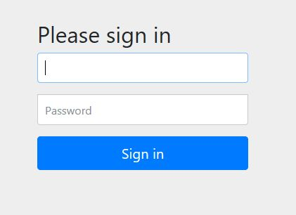

# Spring Security

Eines der komplexesten Themen bei der Web-Programmierung ist sicher das Thema Security. Es lässt sich grob in die Bereiche Authentifzierung (wer ist der Benutzer?) und Authorisierung (was darf der Benutzer?) unterteilen. **Spring Security** bietet für beide Problemstellungen großartige Unterstützung an, kann die Komplexität aber auch nicht ganz verbergen. Hier werden die Grundlagen besprochen.

## Spring Security aktivieren

Spring Security wird aktiviert, in dem der Starter *spring-boot-starter-security* in das POM als Dpendency eingebunden wird:
```xml
<dependency>
  <groupId>org.springframework.boot</groupId>
  <artifactId>spring-boot-starter-security</artifactId>
</dependency>
```

Ohne jegliche weitere Konfiguration ist die Anwendung damit schon rudimentär abgesichert. Ein Neustart der Anwendung und Aufruf einer existierenden URL (zum Beispiel http://localhost:8080) führt zur Spring Default Login-Seite:



Der Default-Username ist *user*, das Passwort wird von Spring in die Konsole geloggt, es ändert sich bei jedem Start der Anwendung:

```
Using generated security password: a5f71022-9ef5-4601-8346-8d09fb9be210
```

Gibt man die Daten ein, wird man von Spring zur eigentlich aufgerufenen Seite weitergeleitet.

Ausloggen ist auch schon möglich, einfach http://localhost:8080/logout aufrufen und nach einer Sicherheitsabfrage wird man wieder ausgeloggt:


Das ist ganz nützlich um beim Konfigurieren der Security verschiedene Einstellungen ausprobieren zu können, ohne ständig den Browser neu zu starten, anonyme Fenster zu verwenden oder ähnliches.


## Authentifizierung
Das generierte Passwort ist natürlich keine praktikable Lösung. Um Benutzer unter anderem Namen und mit dauerhaftem Passwort anzulegen ist eine eigene Security-Konfiguration erforderlich.
Dazu erstellt man eine Konfigurationsklasse, zum Beispiel *SecurityConfig*, die von WebSecurityConfigurerAdapter erbt. Die Authentifzierung wird in der Methode configureGlobal(AuthenticationManagerBuilder) beschrieben:

```java
@Configuration
public class SecurityConfig extends WebSecurityConfigurerAdapter {

    @Autowired
    public void configureGlobal(AuthenticationManagerBuilder auth) throws Exception {
    	auth.inMemoryAuthentication()
        .withUser("user").password("{noop}password").roles("USER")
        .and()
        .withUser("admin").password("{noop}password").roles("ADMIN");
    }
}
```
Hier werden die beiden Benutzer, *user* und *admin* angelegt. Der Ausdruck {noop} vor dem Password führt dazu, dass der *NoOpPasswordEncoder* verwendet wird, die Passwörter werden also der Einfachheit halber unverschlüsselt im Code gespeichert. Für Produktionssysteme ist das nicht zu empfehlen, hier geht es zunächst um das Prinzip. Wie der Methode zu entnehmen ist hat der Benutzer *user* die Rolle *USER* und der Benutzer *admin* die Rolle *ADMIN*.

Im Code, etwa im Controller, erhält man den eingeloggten Benutzer (der heißt auch *Principal*) mit Hilfe des SecurityContextHolder:

```java
Object principal = SecurityContextHolder.getContext().getAuthentication().getPrincipal();
```

Je nach Authentifzierungsmethode ist der Principal von einem anderen Typ. Im hier geschilderten Fall kann er auf UserDetails gecastet werden:

```java
log.info(((UserDetails)principal).getUsername());
```

Die feste Vergabe von Benutzername und Passwort ist nur für einfache Fälle (etwa einen geschützten Kundenbereich auf einer Webseite) hilfreich. In der Praxis wird man die Daten dynamisch anlegen lassen und in einer Datenbank speichern wollen. Das Vorgehen ist dazu ähnlich. Das folgende Codestück zeigt die Konfiguration zur Speicherung der Credentials in einer Datenbank:

```java
auth.jdbcAuthentication()
  .dataSource(dataSource)
  .withDefaultSchema()
  .withUser(User.withUsername("user")
    .password(passwordEncoder().encode("pass"))
    .roles("USER"));
```

## Authorisierung
Das überhaupt eine Default-Login-Maske angezeigt wird, ist in der geerbten Methode *configure(HttpSecurity)* definiert. Sie sieht folgendermaßen aus:

```java
protected void configure(HttpSecurity http) throws Exception {
http
  .authorizeRequests().anyRequest().authenticated()
    .and()
  .formLogin()
    .and()
  .httpBasic();
}
```

Überschreibt man die Methode in SecurityConfig und kommentiert die Zeile *.formLogin().and()* aus, so wird stattdessen das Basic Auth-Popup des Browsers angezeigt.

Die Verwendung der Methode ist ein wenig gewöhnungsbedürftig. Es können über verschiedene *Configurer* die Security-Eigenschaften angepasst und mittels *and()* verknüpft werden. In der Methode oben sind das der *ExpressionUrlAuthorizationConfigurer*, der *FormLoginConfigurer* und der *HttpBasicConfigurer*. Es gibt davon aber noch eine Menge mehr, etwa den *LogoutConfigurer* oder den *CsrfConfigurer*.

Durch überschreiben dieser Methode lassen den oben definierten Rollen URLs zuordnen, so dass man damit bestimmte Bereiche nur für Admins freischalten kann (hier die URL */adminsarea*):

```java
@Override
protected void configure(HttpSecurity http) throws Exception {
http
  .authorizeRequests().antMatchers("/adminsarea").access("hasRole('ADMIN')")
    .and()
  .authorizeRequests().anyRequest().authenticated()
    .and()
  .formLogin()
    .and()
  .httpBasic();
}
```
